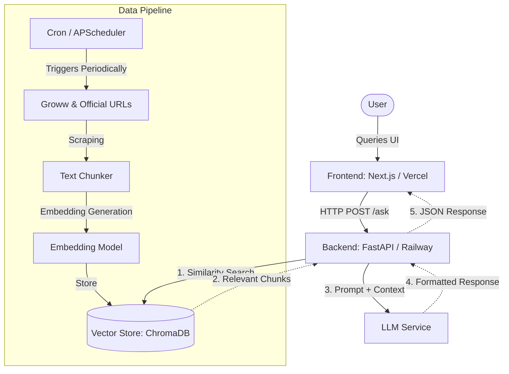

# Comprehensive Phase-Wise Architecture Plan

Based on the rehashed problem statement, this document outlines the end-to-end architectural design for the Mutual Fund FAQ Assistant. The system follows a decoupled Retrieval-Augmented Generation (RAG) architecture, strictly adhering to the facts-only and zero-advice constraints.

## High-Level System Architecture

## Phase 1: Data Curation & Ingestion Architecture

**Objective:** Build the foundational knowledge base offline and store it for rapid retrieval.

### Sequential Sub-Phases

#### Phase 1.1: Environment Setup & Source Definition
- **Data Sources:** 5 defined HDFC Mutual Fund scheme URLs (reference: Groww).
- **Environment:** Initialize Python environment, install required libraries (`langchain`, `chromadb`, `beautifulsoup4`, etc.).

#### Phase 1.2: Scraping & Content Extraction (`scripts/scraper.py`)
- **Scraper Module:** Fetches HTML content from the target URLs.
- **Text Processor:** Cleans HTML, extracts main content, removes boilerplate UI elements (navbars, footers), and explicitly strips out any inadvertently captured PII.

#### Phase 1.3: Sectional Factual Chunking (`scripts/chunker.py`)
- **Strategy:** Instead of generic character splitting, uses **Sectional Chunking**. Converts cleaned JSON into ~8 self-contained factual text blocks per fund:
  1. Basics & Objective
  2. Costs & Benchmarks (NAV, Expense Ratio, Exit Load)
  3. Investment Rules (Min SIP, Lock-in)
  4. Fund Management
  5. Annual Returns & Rankings
  6. SIP Returns
  7. Absolute Returns
  8. Risk Metrics & Riskometer
- **Context Injection:** Every chunk is prefixed with the Fund Name and Category (e.g., "Fund: HDFC Mid Cap | Category: Mid Cap | ...").

#### Phase 1.4: Embedding Generation (`scripts/embedder.py`)
- **Model:** Converts the structured text chunks into high-dimensional vector embeddings.
- **Technology:** Uses **`BAAI/bge-small-en-v1.5`**. This model provides state-of-the-art retrieval accuracy while remaining lightweight (~130MB), making it ideal for the mutual fund domain and deployment on resource-constrained environments like Railway.
- **Query Instruction:** Utilizes a query-side instruction prefix to significantly improve retrieval for short, ambiguous user questions.

#### Phase 1.5: Vector Storage & Indexing (`scripts/db_manager.py`)
- **Storage:** Initialize a local **Chroma DB** instance.
- **Indexing:** Upsert the generated embeddings along with metadata (source URL, last updated timestamp) into the database.

#### Phase 1.6: Automation & Scheduling (`scripts/ingest_all.py` & `.github/workflows/weekly_ingestion.yml`)
- **Scheduler:** Uses a **GitHub Actions** workflow (`weekly_ingestion.yml`) to run the master orchestrator (`ingest_all.py`) every Monday at 10:00 AM IST.
- **Persistence:** Commits the updated ChromaDB and JSON files back to the GitHub repository automatically.
- **Advantage:** Offloads the compute and RAM spikes (scraping and embedding) to GitHub, keeping the backend server (FastAPI) lightweight and focused only on serving queries.

## Phase 2: RAG Backend Architecture

**Objective:** Serve factual responses adhering strictly to formatting and refusal constraints.

### Components
- **Web Framework:** **FastAPI** deployed on **Railway**.
- **API Endpoint:** `POST /api/chat`
  - *Input:* `{ "query": "What is the exit load?" }`
  - *Output:* `{ "response": "The exit load is 1% if redeemed within 1 year.", "citation": "https://...", "footer": "Last updated from sources: 2026-05-06" }`
- **Retrieval Engine:** Connects to Chroma DB, performs k-Nearest Neighbors (k-NN) search to fetch top-k relevant chunks.
- **LLM Orchestrator (LangChain):**
  - **Constraint Prompting:** A strict system prompt enforcing the 3-sentence limit, single citation requirement, and footer inclusion.
  - **Refusal Guardrail:** A preliminary classification step or LLM prompt instruction that detects advisory/performance queries and immediately triggers a predefined refusal template.
- **PII Filter:** Middleware to scan user queries for PAN/Aadhaar patterns and block them before processing.

## Phase 3: Frontend Interface Architecture

**Objective:** Provide a minimal, user-friendly interface to interact with the backend.

### Components
- **Framework:** **Next.js** (or React) deployed on **Vercel**.
- **UI Structure:**
  - **Header:** Welcome message.
  - **Disclaimer Banner:** Highly visible, sticky banner ("Facts-only. No investment advice.").
  - **Chat Interface:** Message history, input field, and loading states.
  - **Quick Questions:** 3 clickable pill buttons for example queries.
- **State Management:** React hooks (`useState`) for chat history.
- **API Client:** `fetch` calls to the Railway FastAPI endpoint.

## Deployment & CI/CD Strategy

1. **Backend (Railway):** 
   - Dockerized Python environment or native Python deployment.
   - The ChromaDB local directory will be bundled with the deployment or mounted if persistent storage is needed (since the dataset is small, bundling the pre-built DB in the image is viable and highly performant).
2. **Frontend (Vercel):**
   - Seamless integration with GitHub for automatic deployments on push to the `main` branch.
